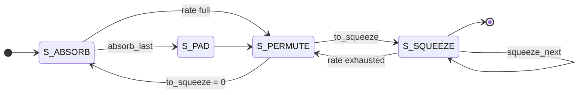
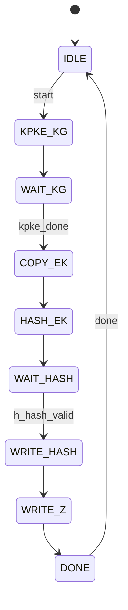
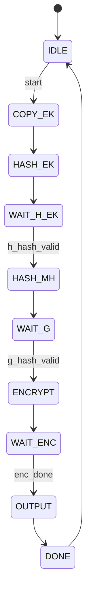
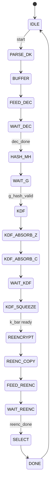

# ML-KEM-768 Hardware Implementation

RTL implementation of an ML-KEM-768 (FIPS 203) lattice-based key-encapsulation
core with an AXI4-Lite slave interface, plus its Known-Answer-Test (KAT)
testbenches and NIST test vectors, simulated with Icarus Verilog and Vivado
2023.2/xsim.

## How ML-KEM works

ML-KEM (FIPS 203, based on CRYSTALS-Kyber) is NIST's post-quantum
key-encapsulation mechanism. Its security rests on the hardness of the
module-learning-with-errors (Module-LWE) problem — a problem believed hard even
for quantum computers. The **ML-KEM-768** parameter set (K=3) operates on
polynomials of degree 255 over the ring `R_q = Z_q[x]/(x^256 + 1)` with
`q = 3329` (12-bit coefficients). The scheme has three phases:

**1. Key generation.** A 32-byte seed `d` is expanded by SHA3-512 into
`(ρ, σ)`. The matrix `Â` is derived deterministically from `ρ` via SHAKE-128 and
rejection sampling; the short secret polynomials `ŝ` and `ê` are sampled from `σ`
with the centered-binomial distribution (CBD). The public vector is
`t̂ = ·ŝ + ê`, all in the NTT domain. The encapsulation key is
`ek = (t̂, ρ)` and the decapsulation key is `dk = dkPKE ‖ ek ‖ H(ek) ‖ z`.

**2. Encapsulation.** `ML-KEM.Encaps(ek, m)` hashes `m` with `H(ek)` via SHA3-512
to derive `(K, r)`. It samples ephemeral noise `ŷ, ê₁, ê₂`, computes
`u = INTT(Âᵀ·ŷ) + ê₁` and `v = INTT(t̂ᵀ·ŷ) + ê₂ + ⌈μ⌉` (the encoded message),
then compresses `(u, v)` into the ciphertext `c`. The shared secret is `K`.

**3. Decapsulation.** `ML-KEM.Decaps(dk, c)` decrypts `m'`, re-derives `(K', r')`,
re-encrypts to `c'`, and returns `K'` if `c' == c`, otherwise the
implicit-rejection key `K̄ = SHAKE-256(z ‖ c)`. The `c == c'` comparison is done
in constant time.

Under the hood the arithmetic uses a number-theoretic transform (NTT) in the
`Z_q` Montgomery domain for fast polynomial multiplication, plus SHA3-256/512 and
SHAKE-128/256 (Keccak-f[1600]) for all hashing and rejection sampling. The
hardware instantiates dedicated NTT, base-multiplication, CBD/noise sampling, and
Keccak blocks, orchestrated by the `mlkem_keygen` / `mlkem_encaps` /
`mlkem_decaps` FSM controllers.

## Status

All blocks were verified byte-exact against the official NIST test vectors (and a
FIPS-203 reference):

| Subsystem | Status |
|-----------|--------|
| Keccak-f[1600], SHA3-256/512, SHAKE-128/256 | PASS — match known hashes |
| NTT / inverse-NTT, base multiplication | PASS |
| K-PKE KeyGen / Encrypt / Decrypt | PASS — round-trip recovers the message |
| ML-KEM KeyGen | PASS — byte-exact `ek`/`dk` vs NIST (25/25) |
| ML-KEM Encaps | PASS — byte-exact `K` + ciphertext |
| ML-KEM Decaps | PASS — byte-exact `K`, and `K̄` on implicit rejection |
| NIST KAT end-to-end (10 vectors) | PASS — KeyGen + Encaps + Decaps |

The NIST vectors are pre-generated in `sim/mem/nist/<i>/` and loaded by
`sim/tb/tb_mlkem_nist_kat.v` via `$readmemh`; no automation scripts are required
(the Python reference model and Vivado driver scripts were removed).

## Directory layout

```
rtl/            RTL sources
  pkg/          parameters (mlkem_params.vh), zeta ROM (ntt_rom.v)
  math/         barrett_reduce, montgomery_reduce, ntt_core, ntt, intt, poly_basemul, poly_arith
  keccak/       keccak_f1600, mlkem_hash_engine, sha3_256/512, shake128/256
  sample/       sample_ntt (rejection), sample_cbd (CBD)
  encode/       byte_encode, byte_decode, compress, decompress
  mem/          poly_ram
  kpke/         kpke_keygen, kpke_encrypt, kpke_decrypt
  mlkem/        mlkem_top (AXI4-Lite), mlkem_core, mlkem_keygen, mlkem_encaps, mlkem_decaps
sim/            simulation sources
  tb/           testbenches (tb_roundtrip, tb_f1600, tb_sha3, tb_ntt_clean, tb_basemul,
                tb_kpke_*, tb_mlkem_*, tb_mlkem_nist_kat)
  mem/          KAT vector header (mlkem_kat_vectors.vh), NIST vectors (nist/<i>/*.mem)
syn/            Cadence Genus synthesis script (syn_mlkem.tcl), constraints (mlkem_top.sdc)
```

## AXI register / memory map (byte-addressed)

```
0x00  CTRL     [W]  [1:0]=op_sel (00=KeyGen,01=Encaps,10=Decaps)  [8]=start
0x04  STATUS   [R]  [0]=busy [1]=done [2]=sticky done
0x08-0x24  SEED_D  (256-bit, 8 words)   KeyGen seed d
0x28-0x44  SEED_Z  (256-bit, 8 words)   implicit-rejection seed z
0x48-0x64  SEED_M  (256-bit, 8 words)   Encaps message m
0x68-0x84  SS      (256-bit, 8 words)   shared secret K / K̄
0x88  BUF_ADDR  [W]  buffer address for EK/DK/CT access
0x8C  BUF_DATA  [R/W]  buffer data byte (auto-increment)
0x90  BUF_SEL   [W]  [1:0] buffer select: 0=EK, 1=DK, 2=CT
```

Buffer sizes (ML-KEM-768): `ek` = 1184 B, `dk` = 2400 B, `ct` = 1088 B, `ss` = 32 B.
Seeds/keys are packed into the registers least-significant byte first
(byte 0 → `reg[7:0]`, byte 31 → `reg[255:248]`), so load NIST vectors in that order.

## How to run (Vivado 2023.2, batch, from the project root)

There are no driver scripts; call the simulator directly. First set the
RTL source list once:

```tcl
set RTL [list \
  rtl/pkg/ntt_rom.v rtl/pkg/mlkem_params.vh rtl/mem/poly_ram.v rtl/math/barrett_reduce.v \
  rtl/math/montgomery_reduce.v rtl/math/modular_arith.v rtl/math/ntt_butterfly.v rtl/math/ntt.v \
  rtl/math/intt.v rtl/math/poly_arith.v rtl/math/poly_basemul.v rtl/sample/sample_ntt.v \
  rtl/sample/sample_cbd.v rtl/encode/byte_decode.v rtl/encode/byte_encode.v rtl/encode/compress.v \
  rtl/encode/decompress.v rtl/keccak/keccak_round.v rtl/keccak/keccak_f1600.v \
  rtl/keccak/mlkem_hash_engine.v rtl/keccak/shake128.v rtl/keccak/shake256.v \
  rtl/keccak/sha3_256.v rtl/keccak/sha3_512.v rtl/kpke/kpke_keygen.v rtl/kpke/kpke_encrypt.v \
  rtl/kpke/kpke_decrypt.v rtl/mlkem/mlkem_keygen.v rtl/mlkem/mlkem_encaps.v \
  rtl/mlkem/mlkem_decaps.v rtl/mlkem/mlkem_axi_lite_if.v rtl/mlkem/mlkem_core.v \
  rtl/mlkem/mlkem_top.v]
```

Each test = compile → elaborate → run. For example **K-PKE round-trip**:

```tcl
xvlog --work xsim -i rtl/pkg -i sim/mem $RTL sim/tb/tb_roundtrip.v
xelab -debug typical -L xsim xsim.tb_roundtrip -s rt_sim
xsim -R rt_sim
```

- **SHA3/Keccak** — `sim/tb/tb_sha3.v`, `sim/tb/tb_f1600.v` (compile with `$RTL`, elaborate `xsim.tb_sha3` / `xsim.tb_f1600`).
- **NTT / base-mul** — `sim/tb/tb_ntt_clean.v`, `sim/tb/tb_basemul.v`.
- **ML-KEM ops** — `sim/tb/tb_mlkem_keygen.v`, `sim/tb/tb_mlkem_core.v`, `sim/tb/tb_mlkem_top.v`.
- **NIST end-to-end** — compile `sim/tb/tb_mlkem_nist_kat.v` with extra include dirs
  `-i rtl/pkg -i sim/mem`, elaborate `xsim.tb_mlkem_nist_kat`, then run in slices to
  avoid the long-run crash:

  ```tcl
  xsim -R nist_sim -testplusarg NIST_START=0 -testplusarg NIST_END=9 -testplusarg PHASE=0
  ```

  (PHASE: 0=all, 1=keygen, 2=encaps, 3=decaps.)

The testbenches load their data by relative path from `sim/mem/` (e.g.
`sim/mem/nist/<i>/ek_<i>.mem`) via `$readmemh`, so always run from the project root.
`iverilog` also works as a fast alternative for the self-checking testbenches
(e.g. `iverilog -g2012 -o rt -I rtl/pkg $(find rtl -name '*.v') sim/tb/tb_roundtrip.v && vvp rt`).

## Timing (measured cycle counts, ML-KEM-768 @ 100 MHz)

Cycle counts below were measured on the RTL datapath (core computation only,
excluding the AXI4-Lite register payload transfer of `ek`/`dk`/`ct`/seeds).

| Operation | Clock cycles | Time @ 100 MHz |
|-----------|--------------|----------------|
| `ML-KEM-768.KeyGen` | 101,484 | ≈ 1.01 ms |
| `ML-KEM-768.Encaps` | 132,895 | ≈ 1.33 ms |
| `ML-KEM-768.Decaps` | 189,472 | ≈ 1.89 ms |
| K-PKE round-trip (KeyGen → Encrypt → Decrypt) | ≈ 281,000 | ≈ 2.81 ms |

| Primitive | Latency (cycles) |
|-----------|------------------|
| `keccak_f1600` permutation | 25 (24 rounds + load) |
| SHA3-512 (`G`) | 25 per 72-byte block (+ squeeze) |
| SHAKE-256 / SHA3-256 | 25 per 136-byte block (+ squeeze) |
| NTT / inverse-NTT | 7 butterfly layers |
| Base multiplication | 128 pointwise products |

These are per-operation, single-shot latencies for one seed; they grow with the
parameter set (larger `K` → more matrix/NTT work).

## FSM state machines

### `mlkem_hash_engine` — shared Keccak sponge (4 states)



### `mlkem_keygen` — ML-KEM.KeyGen (9 states)



### `mlkem_encaps` — ML-KEM.Encaps (10 states)


`HASH_EK` = `H(ek)`; `HASH_MH` = `G(m‖H(ek))` → `(K,r)`; `ENCRYPT` runs
K-PKE.Encrypt; `OUTPUT` emits the shared secret `K`.

### `mlkem_decaps` — ML-KEM.Decaps (20 states)


`PARSE_DK` extracts `h`/`z`; `BUFFER` loads `dkPKE`/`c`; `FEED_DEC` streams to
K-PKE.Decrypt → `m'`; `KDF_*` = `K̄ = SHAKE-256(z‖c)`; `REENC_*` re-encrypts
`c' = Encrypt(ek, m', r')`; `WAIT_REENC` does the constant-time `c == c'` compare;
`SELECT` returns `K'` or `K̄`.

### Tool notes

- Vivado 2023.2 path: `D:\vivado\2023.2\bin\vivado.bat`.
- Do not run more than one batch Vivado at a time in this folder: concurrent
  instances fight over `./xsim`, `xsim.log` and `xsim_files.txt`.
- The batch flow regenerates `./xsim`, `xsim.log`, `xelab.*`, `xvlog.*` at the
  project root on every run; these are disposable build artifacts.
- The full NIST KAT end-to-end run is slow, so slice it with `NIST_START`/`NIST_END`
  (as above); `iverilog` is not the primary runner for the KAT testbench.
